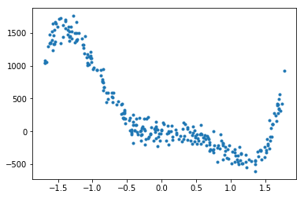
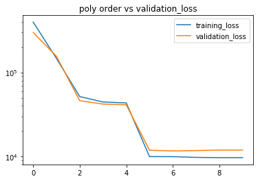
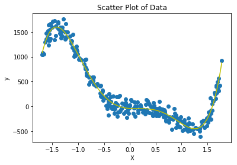
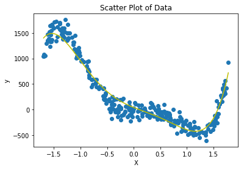
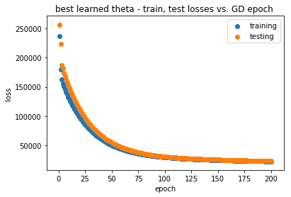
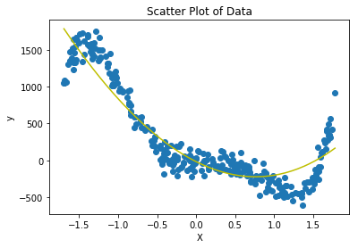
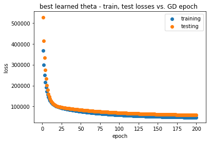
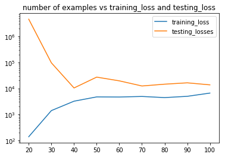
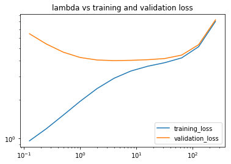
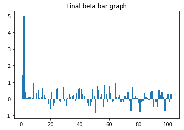

# 1 Polynomial Regression (Programming)


```python
# Machine Learning HW2 Poly Regression

import matplotlib.pyplot as plt
import numpy as np

# Step 1
# Parse the file and return 2 numpy arrays


def load_data_set(filename):
    arr = np.loadtxt(filename)
    x, y = np.split(arr, [-1], axis=1)
    plt.plot(x, y, '.')
    plt.show()
    return x, y

# Find theta using the normal equation


def normal_equation(x, y):
    x_t = np.transpose(x)
    theta = np.dot(np.dot(np.linalg.inv(np.dot(x_t, x)), x_t), y)
    return theta, []

# Step 2:
# Given a n by 1 dimensional array return an n by num_dimension array
# consisting of [1, x, x^2, ...] in each row
# x: input array with size n
# degree: degree number, an int
# result: polynomial basis based reformulation of x


def increase_poly_order(x, degree):
    result = np.array([list(np.power(x.flatten(), i))
                       for i in range(degree+1)]).T
    # normalize
#     result = result / result.max(axis=0)
    return result

# split the data into train and test examples by the train_proportion
# i.e. if train_proportion = 0.8 then 80% of the examples are training and 20%
# are testing


def train_test_split(x, y, train_proportion):
    # your code
    num_train = int(x.shape[0] * train_proportion)
    x_train, x_test = x[:num_train, :], x[num_train:, :]
    y_train, y_test = y[:num_train, :], y[num_train:, :]
    return x_train, x_test, y_train, y_test

# Find theta using the gradient descent


def solve_regression(x, y, num_iterations=100, learning_rate=0.002):
    # your GD code from HW1 or better version
    num_features = x.shape[1]
    thetas = []
    theta = np.array([[0] for i in range(num_features)])
    for _ in range(num_iterations):
        gradient_sum = np.array([[0.0] for i in range(num_features)])
        for row, label in zip(x, y):
            gradient_sum = gradient_sum - learning_rate * \
                row[:, np.newaxis] * (np.dot(row, theta) - label)
        theta = theta + gradient_sum
        thetas.append(theta)
    return theta, thetas

# Given an array of y and y_predict return loss
# y: an array of size n
# y_predict: an array of size n
# loss: a single float


def get_loss(y, y_predict):
    diff = y - y_predict
    loss = np.dot(diff.T, diff) / len(y)
    return loss[0][0]

# Given an array of x and theta predict y
# x: an array with size n x d
# theta: np array including parameters
# y_predict: prediction labels, an array with size n


def predict(x, theta):
    # your code
    y_predict = x.dot(theta)
    return y_predict


# Given a list of thetas one per (s)GD epoch
# this creates a plot of epoch vs prediction loss (one about train, and another about test)
# this figure checks GD optimization traits of the best theta
def plot_epoch_losses(x_train, x_test, y_train, y_test, best_thetas, title):
    # your code
    epochs = []
    losses = []
    epoch_num = 1
    for theta in best_thetas:
        losses.append(get_loss(y_train, predict(x_train, theta)))
        epochs.append(epoch_num)
        epoch_num += 1
    fig, ax = plt.subplots()
    ax.scatter(epochs, losses, label="training")
    plt.xlabel("epoch")
    plt.ylabel("loss")
    plt.title(title)
    # plt.show()

    epochs = []
    losses = []
    epoch_num = 1
    for theta in best_thetas:
        losses.append(get_loss(y_test, predict(x_test, theta)))
        epochs.append(epoch_num)
        epoch_num += 1
    ax.scatter(epochs, losses, label="testing")
    ax.legend()
    # plt.xlabel("epoch")
    # plt.ylabel("loss")
    # plt.title(title + "on testing data")
    plt.show()


# Given a list of degrees.
# For each degree in the list, train a polynomial regression.
# Return training loss and validation loss for a polynomial regression of order degree for
# each degree in degrees.
# Use 60% training data and 20% validation data. Leave the last 20% for testing later.
# Input:
# x: an array with size n x d
# y: an array with size n
# degrees: A list of degrees
# Output:
# training_losses: a list of losses on the training dataset
# validation_losses: a list of losses on the validation dataset
def get_loss_per_poly_order(x, y, degrees):
    # your code
    training_losses = []
    validation_losses = []
    for degree in degrees:
        augmented_x = increase_poly_order(x, degree)
        x_train, x_test, y_train, y_test = train_test_split(
            augmented_x, y, 0.6)
        x_validation, x_test, y_validation, y_test = train_test_split(
            x_test, y_test, 0.5)
        theta, thetas = normal_equation(x_train, y_train)
        training_losses.append(get_loss(y_train, predict(x_train, theta)))
        validation_losses.append(
            get_loss(y_validation, predict(x_validation, theta)))
    return training_losses, validation_losses

# Give the parameter theta, best-fit degree , plot the polynomial curve


def best_fit_plot(theta, degree):
    # your code
    augmented_x = increase_poly_order(x, degree)
    y_predict = predict(augmented_x, theta)
    sorted_y_predict = [y for _, y in sorted(zip(x[:, 0], y_predict))]
    plt.scatter(x[:, 0], y)
    plt.plot(sorted(x[:, 0]), sorted_y_predict, 'y')
    plt.xlabel("X")
    plt.ylabel("y")
    plt.title("Scatter Plot of Data")
    plt.show()


def select_hyperparameter(degrees, x_train, x_test, y_train, y_test):
    # Part 1: hyperparameter tuning:
    # Given a set of training examples, split it into train-validation splits
    # do hyperparameter tune
    # come up with best model, then report error for best model
    training_losses, validation_losses = get_loss_per_poly_order(
        x_train, y_train, degrees)
    plt.plot(degrees, training_losses, label="training_loss")
    plt.plot(degrees, validation_losses, label="validation_loss")
    plt.yscale("log")
    plt.legend(loc='best')
    plt.title("poly order vs validation_loss")
    plt.show()

    # Part 2:  testing with the best learned theta
    # Once the best hyperparameter has been chosen
    # Train the model using that hyperparameter with all samples in the training
    # Then use the test data to estimate how well this model generalizes.
    best_degree = 5  # fill in using best degree from part 2
    x_train = increase_poly_order(x_train, best_degree)
    best_theta, best_thetas = normal_equation(x_train, y_train)
    print(best_theta)
    best_fit_plot(best_theta, best_degree)
    x_test = increase_poly_order(x_test, best_degree)
    test_loss = get_loss(y_test, predict(x_test, best_theta))
    train_loss = get_loss(y_train, predict(x_train, best_theta))
    return best_degree, best_theta, train_loss, test_loss


# Given a list of dataset sizes [d_1, d_2, d_3 .. d_k]
# Train a polynomial regression with first d_1, d_2, d_3, .. d_k samples
# Each time,
# return the a list of training and testing losses if we had that number of examples.
# We are using 0.5 as the training proportion because it makes the testing_loss more stable
# in reality we would use more of the data for training.
# Input:
# x: an array with size n x d
# y: an array with size n
# example_num: A list of dataset size
# Output:
# training_losses: a list of losses on the training dataset
# testing_losses: a list of losses on the testing dataset
def get_loss_per_tr_num_examples(x, y, example_num, train_proportion):
    # your code
    print(x.shape)
    training_losses = []
    testing_losses = []
    for n in example_num:
        x_available, y_available = x[:n], y[:n]
        x_train, x_test, y_train, y_test = train_test_split(
            x_available, y_available, train_proportion)
        theta, thetas = normal_equation(x_train, y_train)
        training_losses.append(get_loss(y_train, predict(x_train, theta)))
        testing_losses.append(get_loss(y_test, predict(x_test, theta)))
    return training_losses, testing_losses
```

# Loading Data Set


```python
x, y = load_data_set("dataPoly.txt")
```





## Task1 & Task2


```python
# select the best polynomial through train-validation-test formulation
x, y = load_data_set("dataPoly.txt")
x_train, x_test, y_train, y_test = train_test_split(x, y, 0.8)
degrees = [i for i in range(10)]
best_degree, best_theta, train_loss, test_loss = select_hyperparameter(
    degrees, x_train, x_test, y_train, y_test)
```





    [[ -42.7987349 ]
     [ -73.48160041]
     [ 454.86959156]
     [-927.86375004]
     [ -63.57127418]
     [ 307.7877446 ]]
    





As we can see in the poly order vs validation loss figure, increasing the degree beyond 5 does not decrese the validation loss, which makes sense because y is produced by a quintic(degree5) polynomial function


With the degree set to 5, the best theta is $[-4.49472078e+01, -7.59089828e+00, 1.06657223e+01, -4.93874067e+00, -5.94462091e-03, 4.94797665e-02]^T$, which is reasonably close to the data generation function $0.05x^5 - 5x^3 + 10x^2-5x-30$

## Task3


```python
def trainGD(degrees, x_train, x_test, y_train, y_test, best_degree = 5):
    # Part 2:  testing with the best learned theta
    # Once the best hyperparameter has been chosen
    # Train the model using that hyperparameter with all samples in the training
    # Then use the test data to estimate how well this model generalizes.
    x_train = increase_poly_order(x_train, best_degree)
    best_theta, best_thetas = solve_regression(x_train, y_train, 200, 0.0002)
    print(best_theta)
    best_fit_plot(best_theta, best_degree)
    x_test = increase_poly_order(x_test, best_degree)
    test_loss = get_loss(y_test, predict(x_test, best_theta))
    train_loss = get_loss(y_train, predict(x_train, best_theta))

    # Part 3: visual analysis to check GD optimization traits of the best theta
    plot_epoch_losses(x_train, x_test, y_train, y_test, best_thetas,
                      "best learned theta - train, test losses vs. GD epoch ")
    return best_degree, best_theta, train_loss, test_loss

# select the best polynomial through train-validation-test formulation
x, y = load_data_set("dataPoly.txt")
x_train, x_test, y_train, y_test = train_test_split(x, y, 0.8)
degrees = [i for i in range(10)]
print("degree=5")
best_degree, best_theta, train_loss, test_loss = trainGD(
    degrees, x_train, x_test, y_train, y_test)
print("degree=3")
best_degree, best_theta, train_loss, test_loss = trainGD(
    degrees, x_train, x_test, y_train, y_test, 3)
```


    degree=5
    [[  41.52331804]
     [-419.28587676]
     [ 210.20916279]
     [-413.00549955]
     [  28.46261813]
     [ 157.56251091]]
    








    degree=3
    [[ -17.20149937]
     [-531.21580312]
     [ 335.34485717]
     [  12.05204491]]
    








The above figure shows that if we choose too small a degree, the difference between the training error and the testing error will be a little larger because the model isn't complex enough to capture the patterns in the data

## Task4


```python
# Part 4: analyze the effect of revising the size of train data:
# Show training error and testing error by varying the number for training samples
x, y = load_data_set("dataPoly.txt")
x = increase_poly_order(x, 8)
example_num = [10*i for i in range(2, 11)]  # python list comprehension
training_losses, testing_losses = get_loss_per_tr_num_examples(
    x, y, example_num, 0.5)
plt.plot(example_num, training_losses, label="training_loss")
plt.plot(example_num, testing_losses, label="testing_losses")
plt.yscale("log")
plt.legend(loc='best')
plt.title("number of examples vs training_loss and testing_loss")
plt.show()
```


    (300, 9)
    





In the figure above, we can see testing loss reaches its minumum at $n=40$. After that, more traning examples didn't help imporving the performance of the model. I suspect this is because we set the degree to 8, which is higher than that of the data generation function, making the model prone to overfitting.

# 2 Ridge Regression (programming and QA)

## 2.1 QA
### 1.1
$$\frac{\partial J(\beta)}{\partial \beta} = \frac{y^T-y^TX\beta - \beta^TX^Ty+\beta^TX^TX\beta+\lambda\beta^T\beta}{\partial \beta} = \frac{\beta^TX^TX\beta - 2\beta^TX^Ty + \beta^T(\lambda I)\beta}{\partial \beta} = 2X^TX\beta - 2X^Ty + 2\lambda \beta$$
Set the equation to 0, and we get:
$$2X^TX\beta+2\lambda\beta = 2X^Ty$$
$$\beta = (X^TX+\lambda I)^{-1}X^Ty$$

### 1.2
No if we don't apply regularization, because $$X^TX=\begin{bmatrix}1 & 3 & 5\\2 & 6 & 10\end{bmatrix}\begin{bmatrix}1 & 2\\3 & 6 \\5 & 10\end{bmatrix} = \begin{bmatrix}35 & 70\\70 & 140\end{bmatrix}$$, which is not invertible.

If we use Ridge regression, however, the question becomes solvable, becase $\begin{bmatrix}35 & 70\\70 & 140\end{bmatrix} - \lambda I$ will be invertible

### 1.3
Lasso regression, because it prefers 0 coefficients

## 2.2 Programming


```python
# Machine Learning HW2 Ridge Regression

import matplotlib.pyplot as plt
import numpy as np

# Parse the file and return 2 numpy arrays


def load_data_set(filename):
    arr = np.loadtxt(filename)
    x, y = np.split(arr, [-1], axis=1)
    return x, y

# Split the data into train and test examples by the train_proportion
# i.e. if train_proportion = 0.8 then 80% of the examples are training and 20%
# are testing


def train_test_split(x, y, train_proportion):
    num_train = int(x.shape[0] * train_proportion)
    x_train, x_test = x[:num_train, :], x[num_train:, :]
    y_train, y_test = y[:num_train, :], y[num_train:, :]
    return x_train, x_test, y_train, y_test

# Find theta using the modified normal equation
# Note: lambdaV is used instead of lambda because lambda is a reserved word in python


def normal_equation(x, y, lambdaV):
    # your code
    x_t = np.transpose(x)
    n = x.shape[1]
    beta = np.dot(np.dot(np.linalg.inv(
        np.dot(x_t, x) + lambdaV * np.identity(n)), x_t), y)
    return beta

# Extra Credit: Find theta using gradient descent


def gradient_descent(x, y, lambdaV, num_iterations, learning_rate):
    # your code
    return beta

# Given an array of y and y_predict return loss


def get_loss(y, y_predict):
    diff = y - y_predict
    loss = np.dot(diff.T, diff) / len(y)
    return loss[0][0]

# Given an array of x and theta predict y


def predict(x, theta):
    # your code
    y_predict = x.dot(theta)
    return y_predict

# Find the best lambda given x_train and y_train using 4 fold cv


def cross_validation(x_train, y_train, lambdas, n_folds=4):
    valid_losses = []
    training_losses = []
    num_examples = x_train.shape[0]
    num_per_fold = num_examples//n_folds
    # your code
    for lambda_ in lambdas:
        valid_loss_sum = 0
        training_loss_sum = 0
        for i in range(n_folds):
            testing_start = i*num_per_fold
            beta = normal_equation(np.concatenate((x_train[0:testing_start], x_train[testing_start+num_per_fold:]), axis=0), np.concatenate(
                (y_train[0:testing_start], y_train[testing_start+num_per_fold:]), axis=0), lambda_)
            training_loss_sum += get_loss(np.concatenate((y_train[0:testing_start], y_train[testing_start+num_per_fold:]), axis=0), predict(
                np.concatenate((x_train[0:testing_start], x_train[testing_start+num_per_fold:]), axis=0), beta))
            valid_loss_sum += get_loss(y_train[testing_start: testing_start+num_per_fold], predict(
                x_train[testing_start: testing_start+num_per_fold], beta))
        valid_losses.append(valid_loss_sum/n_folds)
        training_losses.append(training_loss_sum/n_folds)

    return np.array(valid_losses), np.array(training_losses)


def bar_plot(best_beta):
    x = range(1, best_beta.shape[0]+1)
    plt.bar(x=x, height=best_beta.flatten())
    plt.title("Final beta bar graph")
    plt.show()
```

## Task1


```python
# step 1
# If we don't have enough data we will use cross validation to tune hyperparameter
# instead of a training set and a validation set.
x, y = load_data_set("dataRidge.txt")  # load data
x_train, x_test, y_train, y_test = train_test_split(x, y, 0.8)
# Create a list of lambdas to try when hyperparameter tuning
lambdas = [2**i for i in range(-3, 9)]
lambdas.insert(0, 0)
# Cross validate
valid_losses, training_losses = cross_validation(x_train, y_train, lambdas)
# Plot training vs validation loss
plt.plot(lambdas[1:], training_losses[1:], label="training_loss")
# exclude the first point because it messes with the x scale
plt.plot(lambdas[1:], valid_losses[1:], label="validation_loss")
plt.legend(loc='best')
plt.xscale("log")
plt.yscale("log")
plt.title("lambda vs training and validation loss")
plt.show()

best_lambda = lambdas[np.argmin(valid_losses)]
print('best lambda: {}'.format(best_lambda))
```





    best lambda: 4
    

As shown in the above graph, training loss keeps increasing as lambda increases because it prevents the regression from overfitting the training data.Validation loss, on the other hand, decreases when we increase lambda, that is, up to lambda=4, because it not overfitting the test data set allows the model to generalize better. But if we increase the value of lambda beyond 4, the model starts to have a hard time learning the pattern in the data, so the validation loss goes up.

## Task2


```python
# step 2: analysis
normal_beta = normal_equation(x_train, y_train, 0)
best_beta = normal_equation(x_train, y_train, best_lambda)
large_lambda_beta = normal_equation(x_train, y_train, 512)
# your code get l2 norm of normal_beta
normal_beta_norm = np.linalg.norm(normal_beta)
# your code get l2 norm of best_beta
best_beta_norm = np.linalg.norm(best_beta)
# your code get l2 norm of large_lambda_beta
large_lambda_norm = np.linalg.norm(large_lambda_beta)
print('best lambda: {}'.format(best_lambda))
print("L2 norm of normal beta:  " + str(normal_beta_norm))
print("L2 norm of best beta:  " + str(best_beta_norm))
print("L2 norm of large lambda beta:  " + str(large_lambda_norm))
print("Average testing loss for normal beta:  " +
      str(get_loss(y_test, predict(x_test, normal_beta))))
print("Average testing loss for best beta:  " +
      str(get_loss(y_test, predict(x_test, best_beta))))
print("Average testing loss for large lambda beta:  " +
      str(get_loss(y_test, predict(x_test, large_lambda_beta))))

# Step3: Retrain a new model using all sampling in training, then report error on testing set
# your code !
final_beta = normal_equation(x_train, y_train, best_lambda)
print("Final testing loss:  " +
      str(get_loss(y_test, predict(x_test, final_beta))))

# Step Extra Credit: Implement gradient descent, analyze and show it gives the same or very similar beta to normal_equation
# to prove that it works
```

    best lambda: 4
    L2 norm of normal beta:  30.269654798800733
    L2 norm of best beta:  6.640092215033666
    L2 norm of large lambda beta:  4.651284674384335
    Average testing loss for normal beta:  11.031286619643865
    Average testing loss for best beta:  4.636831026037389
    Average testing loss for large lambda beta:  12.126420332837494
    Final testing loss:  4.636831026037389
    

As lambda increases, we get smaller norms of $\beta$, which helps generalization, but up to a point. If the lambda is too large, the model won't be able to properly fit the data

## Task3


```python
bar_plot(final_beta)
```





The data generation function is $5x+3+noise$, so overall the model was able to capture the pattern of the data fairly well.

# Sample questions
## Question 1. Basis functions for regression
No. This is not a good selection of basis functions in that all the three basis function don't overlap in the range the x where they have effect, i.e. $\phi_1$ only has effect when $0\leq x\leq2$, $\phi_2$ only has effect when $2\leq x\leq4$, $\phi_3$ only has effect when $4\leq x\leq6$, redering the basis functions unable to complement one another, and giving the model little flexibility. For example, this model can't fit a straight line
## Question 2. Polynomial Regression
0, because $y=x^2$ fits the data perfectly
If we leave (1, 1) out, we get $4=2\beta_1 + 4\beta_2$ and $9=3\beta_1 + 9\beta_2$, which gives us $\beta_2 = 1, \beta_1 = 0$ This gives us an error of $1^2-1 = 0$

If we leave (2, 4) out, we get $1=\beta_1 + \beta_2$ and $9=3\beta_1 + 9\beta_2$, which also gives us $\beta_2 = 1, \beta_1 = 0$ This gives us an error of $2^2-4 = 0$

Leaving (3, 9) out, we get $4=2\beta_1 + 4\beta_2$ and $1=\beta_1 + \beta_2$, which, again, gives us $\beta_2 = 1, \beta_1 = 0$ This gives us an error of $3^2-9 = 0$
So the mse = $(0+0+0)/3 = 0$
